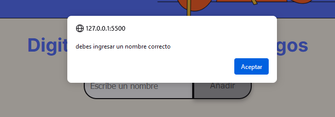
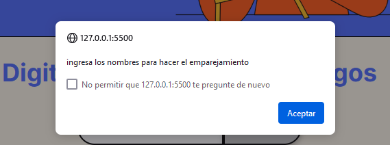

<em style='font-size: 30px'>CHALLENGE AMIGO SECRETO</em>

en este proyecto lo solo se tuvo que implementar el codigo javascript para hacer el ingreso de los nombres de las personas que participaran en el amigo secreto y la funcion que permitira hacer el sorteo

se ingresan los nombres en el input de tipo text, un nombre a la vez.

si se intenra ingresar un campo vacio, la apllicacion lanzara una alerta que te pide ingresar un nombre correcto

el boton para sortear amigo, si se intenta hacer el sorteo pero no hay integrantes en la lista, te arroja una alerta que te pide ingresar los nombres para darte el amigo secreto

